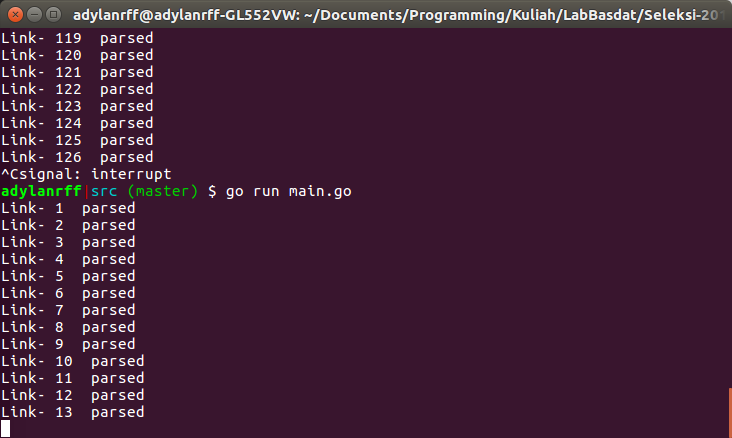
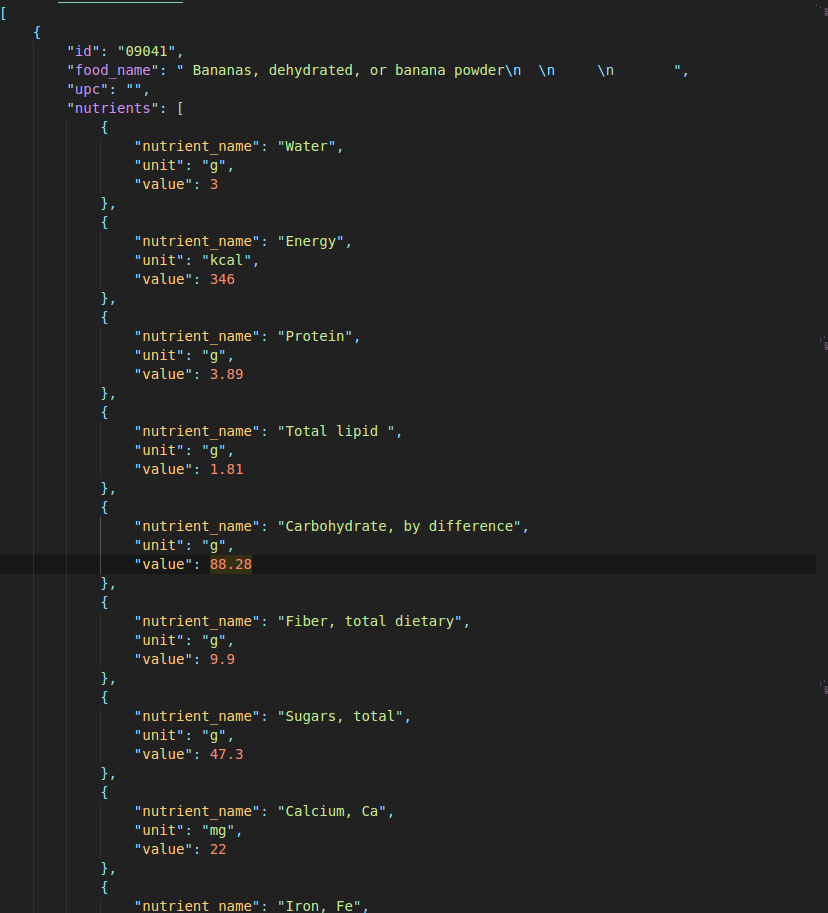

<h1 align="center">FoodCrawler</h1>

## Description

A web scrapper that scraps foods data from [**USDA Database**](https://ndb.nal.usda.gov/ndb/search/list). The scrapped data contains the nutrients of the food per 100 g. Returns the **JSON** object of the parsed data from the website. 

See JSON Structure for further details.

## Specification

1. Lakukan data scraping dari sebuah laman web untuk memeroleh data atau informasi tertentu __TANPA MENGGUNAKAN API__

2. Daftarkan judul topik yang akan dijadikan bahan data scraping pada spreadsheet berikut: [Topik Data Scraping](http://bit.ly/TopikDataScraping). Usahakan agar tidak ada peserta dengan topik yang sama. Akses edit ke spreadsheet akan ditutup tanggal 10 Mei 2018 pukul 20.00 WIB

3. Dalam mengerjakan tugas 1, calon warga basdat terlebih dahulu melakukan fork project github pada link berikut: https://github.com/wargabasdat/Seleksi-2018/tree/master/Tugas1. Sebelum batas waktu pengumpulan berakhir, calon warga basdat harus sudah melakukan pull request dengan nama ```TUGAS_SELEKSI_1_[NIM]```

4. Pada repository tersebut, calon warga basdat harus mengumpulkan file script dan json hasil data scraping. Repository terdiri dari folder src dan data dimana folder src berisi file script/kode yang __WELL DOCUMENTED dan CLEAN CODE__ sedangkan folder data berisi file json hasil scraper.

5. Peserta juga diminta untuk membuat Makefile sesuai template yang disediakan, sehingga program dengan gampang di-_build_, di-_run_, dan di-_clean_

``` Makefile
all: clean build run

clean: # remove data and binary folder

build: # compile to binary (if you use interpreter, then do not implement it)

run: # run your binary

```

6. Deadline pengumpulan tugas adalah __15 Mei 2018 Pukul 23.59__

7. Tugas 1 akan didemokan oleh masing-masing calon warga basdat

8. Demo tugas mencakup keseluruhan proses data scraping hingga memeroleh data sesuai dengan yang dikumpulkan pada Tugas 1

9. Hasil data scraping ini nantinya akan digunakan sebagai bahan tugas analisis dan visualisasi data

10. Sebagai referensi untuk mengenal data scraping, asisten menyediakan dokumen "Short Guidance To Data Scraping" yang dapat diakses pada link berikut: [Data Scraping Guidance](http://bit.ly/DataScrapingGuidance)

11. Tambahkan juga gitignore pada file atau folder yang tidak perlu di upload, __NB : BINARY TIDAK DIUPLOAD__

12. JSON harus dinormalisasi dan harus di-_preprocessing_
```
Preprocessing contohnya :
- Cleaning
- Parsing
- Transformation
- dan lainnya
```

13. Berikan README yang __WELL DOCUMENTED__ dengan cara __override__ file README.md ini. README harus memuat minimal konten :
```
- Description
- Specification
- How to use
- JSON Structure
- Screenshot program (di-upload pada folder screenshots, di-upload file image nya, dan ditampilkan di dalam README)
- Reference (Library used, etc)
- Author
```


## How to use

To compile the program:
```
$ make build
```
The program then compiled with name *foodCrawler*

To run the program:
```
$ make run
```

Or (if you have compiled it before) : 
```
$ ./foodCrawler
```


## JSON Structure
Returns an array of *Food* object that contains the *id, food_name, upc, nutrients* of the food. *nutrients* is an object that resembles the *Nutrient* object that is contained in a food. 

*Nutrient* object contains the *nutrient_name, unit, value* for a nutrient.

``` 
[
  {
    "id"
    "food_name"
    "upc"
    "nutrients" : [
      {
        "nutrient_name" : 
        "unit" : 
        "value" :
      },
      {
        "nutrient_name" : 
        "unit" : 
        "value" :
      }, 
      ...
    ]
  }
   
]
```


## Screenshots

### Program Screenshot


### JSON Example



## Reference
[Go Soup - Beautiful Soup for Go](https://github.com/anaskhan96/soup)


## Author

<h3> Adylan Roaffa Ilmy </h3>
<h3> 13516016 </h3>